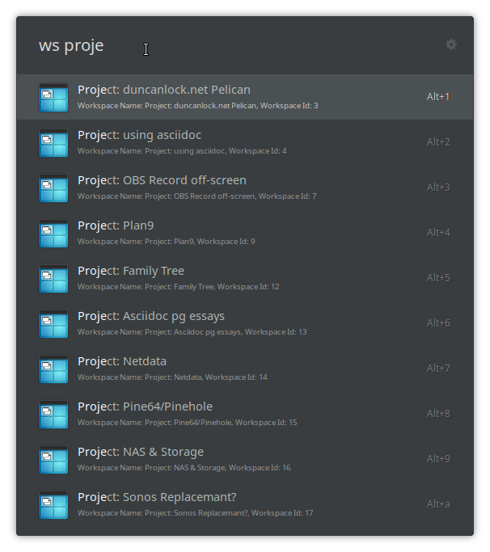

# Xfwm Workspace Switcher plugin for Ulauncher

This is a plugin for [uLauncher](https://ulauncher.io/) that lets you search & switch between XFCE/Xfwm workspaces by name:



The default keyword in `ws`, so just run Ulauncher, then type `ws <query>` to filter the workstation list, then select a workspace from the list to switch to that workspace.

I used workspace icons from the [Obsidian Icon pack](https://github.com/madmaxms/iconpack-obsidian)

## Requirements

You need `wmctrl` installed. See: https://www.freedesktop.org/wiki/Software/wmctrl/

For Debian/Ubuntu, you can do:

```shell
$ sudo apt install wmctrl
```
